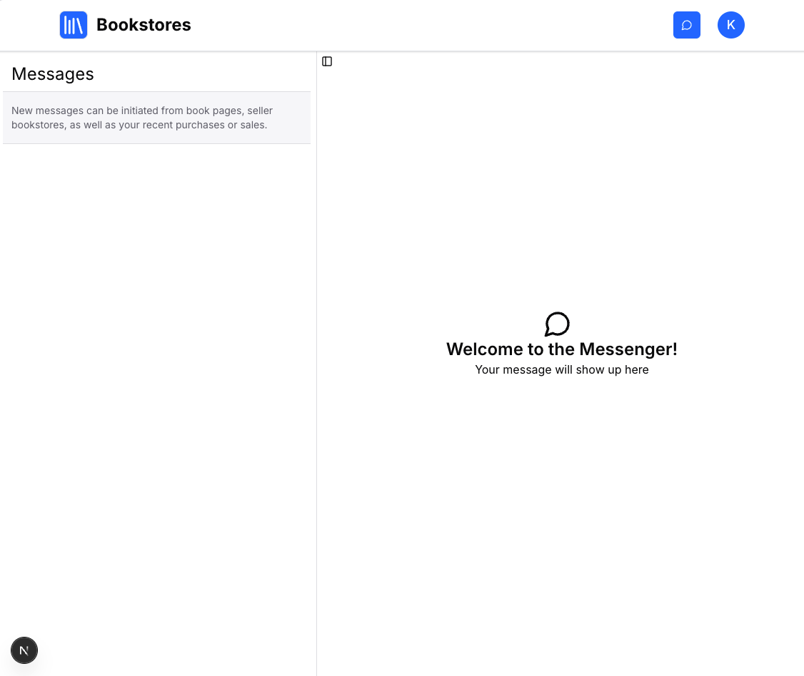
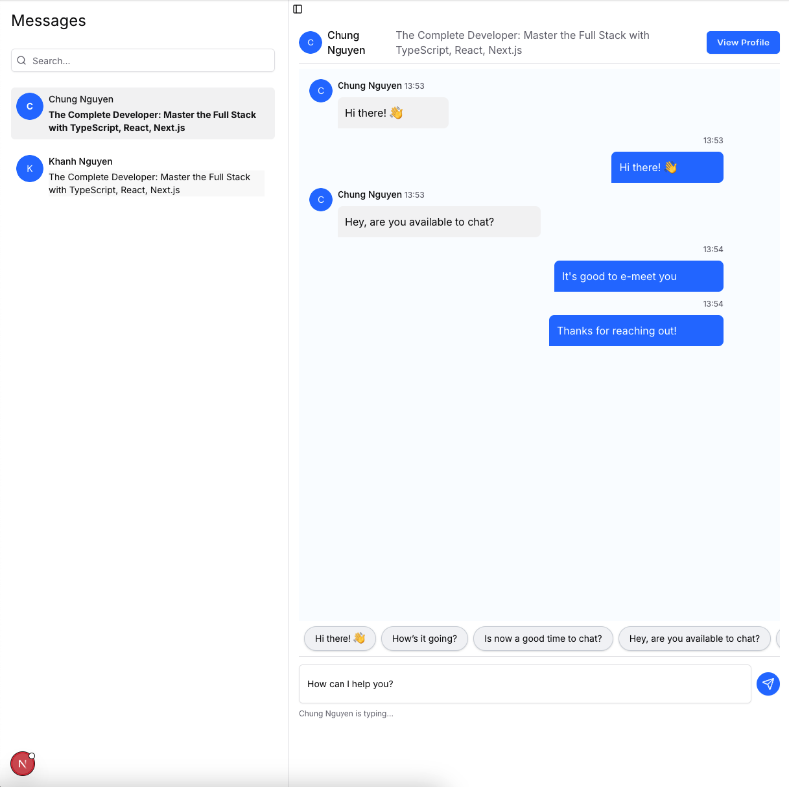
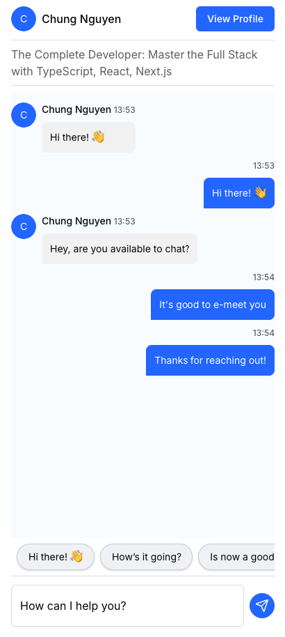

# 💬 NextJS Real-Time Chat App

[](https://nextjs.org)
[](https://socket.io)
[](https://www.prisma.io)
[](https://authjs.dev)

A full-stack, real-time chat application built with Next.js 15, React 19, Prisma, and SQLite.  
Supports private 1-on-1 messaging, group channels, and marketplace-style product discussions.

---

## 🚀 Features

- 🔐 **Authentication** – Login system with user-specific channel access
- 💬 **Direct & Group Messaging** – Message individuals or participate in group chats
- 🛍️ **Product-Based Chats** – Start conversations about specific items (C2C functionality)
- 🔄 **Real-Time Updates** – Messages appear instantly via Socket.IO
- 📂 **Channel Sidebar** – View all active channels on the left panel
- 📥 **Message History** – Persistent storage of messages in SQLite
- 🔔 **Toasts for New Messages** – Receive notifications for incoming messages
- 🧑‍🤝‍🧑 **Channel Ownership** – Group channels with designated owners
- 📱 **Responsive UI** – Mobile-first, clean interface with Shadcn + Tailwind

---

## 🧰 Tech Stack

### ⚙️ Backend
- **Auth.js (NextAuth)** for authentication
- **Next.js 15 (App Router + Pages Router)**
- **React 19**
- **Socket API Routes (`/pages/api/socket.ts`)**
- **Prisma ORM**
- **SQLite or Postgress DB**
- **Socket.IO** for real-time messaging

### 🎨 Frontend
- **Shadcn UI** for consistent styling
- **Tailwind CSS**
- **TanStack Query** for data fetching
- **Socket.IO Client**

### 🧪 Dev Tools
- **TypeScript**
- **ESLint & Prettier**
- **dotenv**

---

## 🛠️ Getting Started

1. **Clone the repo**
   ```bash
   git clone https://github.com/khahantk/next-chat-app.git
   cd next-chat-app
   ```

2. **Install dependencies**
   ```bash
   npm install
   ```

3. **Set up environment variables**
   Create a `.env.local` file with:

   ```env
   DATABASE_URL="file:./dev.db"
   NEXT_PUBLIC_SOCKET_URL=http://localhost:3000
   ```

4. **Generate Prisma client and migrate**
   ```bash
   npx prisma generate
   npx prisma migrate dev --name init
   ```

5. **Run the dev server**
   ```bash
   npm run dev
   ```

---

## 📸 Screenshots

### Welcome Message


### Chat Page With List Channel Sidebar


### Mobile


---

## 🧑‍💻 Author

Made with ❤️ by [Chung Nguyen](https://github.com/khahantk)

---

## 📄 License

MIT
